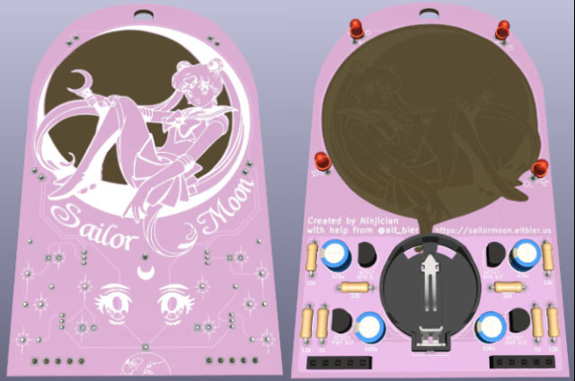
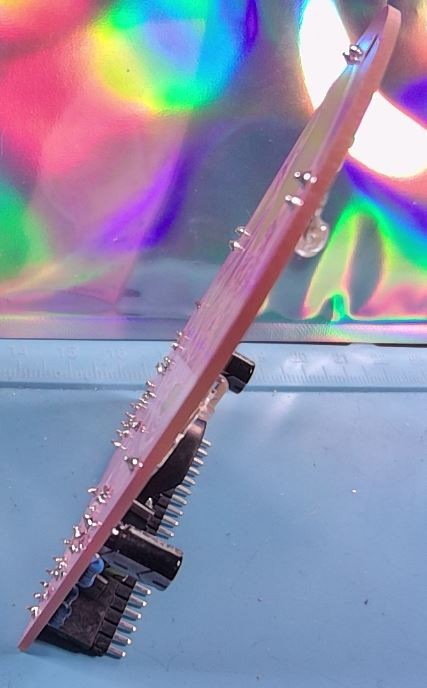
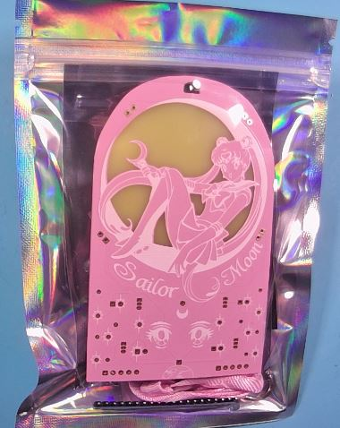
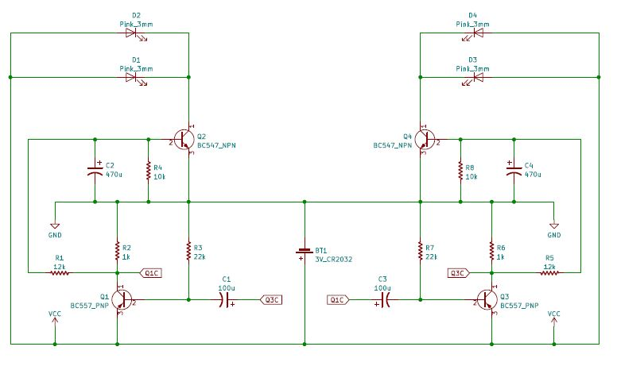
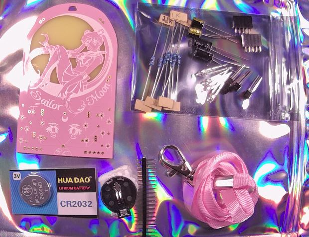
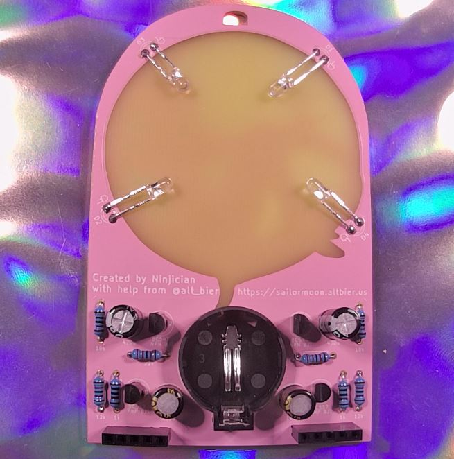
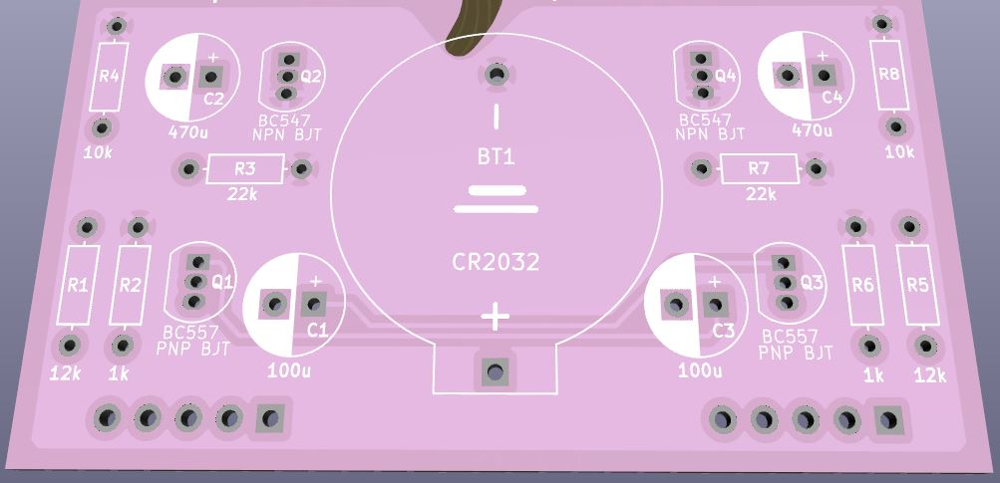
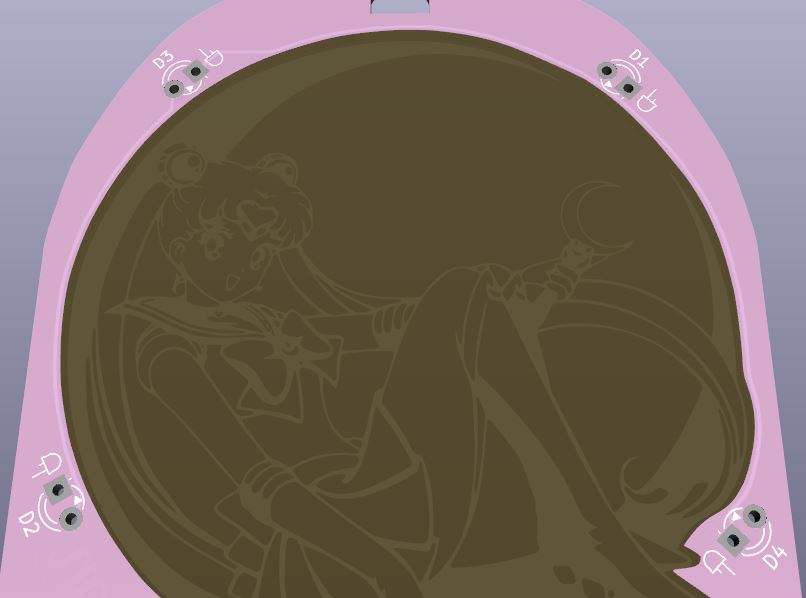

# Welcome

Welcome to the sailor moon badge website/repository.

This is where you will find all the details and files and instructions related to the DC31 sailor moon badge #badgelife.

# Story

I noticed at defcon 30 that there were no anime badges or cute badges I found appealing.

So, I wanted to make a cute sailor moon themed badge that was easy to assemble and could stand on its own to be displayed with figures and other collectables.

I think this badge turned out great and I hope everyone enjoys it.

-- Ninjician

---

# Details

The badge is designed with a simple easy to solder circuit that utilizes back lighting to highlight the art.

It uses female and male header pins on the bottom of the badge to make a stand that allows the badge to stand upright on a flat surface.

While a few assembled badges will be available most will be provided as DIY solder kits.

## The Circuit

The circuit is based on an astable multivibrator with the resistance and capacitance adjusted to produce the LED fade effect.

Here is the circuit schematic

## Kit Contents

The kit contains the following items:

* 1x PCB
* 1x Lanyard
* 1x 1x20 pin Male Header
* 1x CR2032 Battery Holder
* 1x CR2032 Battery
* 2x 1x5 pin Female Header
* 2x 22k ohm Resistor
* 2x 12k ohm Resistor
* 2x 10k ohm Resistor
* 2x 1k ohm Resistor
* 2x BC547 NPN BJT Transistor
* 2x BC557 PNP BJT Transistor
* 2x 100uF Polorized Capacitor
* 2x 470uF Polorized Capacitor
* 4x 3mm 2-pin Pink LED

# Kit Assembly

To assemble this badge you will place the through hole components into the pcb with the component body on the back of the pcb soldering the legs on the front of the pcb trimming them off at the top of the solder joints.

The back of the pcb has clear labels of where to place the components.

Take note of the direction of the transistors (which way the flat side faces) and make sure you place the proper transistor type in each space (the labels on the transistors are very small but are the only way to tell the difference between the two types).

Take note of the capacitor polarity inserting the negative leg into the negative hole which is indicated by solid silkscreen on the pcb.
The capacitors are labeled with the uF value and have a solid stripe on the negative leg side.

The resistors are bidirectional so it does not matter which way they are inserted as long as the proper resistance ohm value is used for each.  The pcb has the resistor values clearly labeled and while the resistors have a color code to show thier value, for your convinience the value has been written on the paper attached to them.

The LEDs should not be fully inserted instead leaving enough leg space for them to be bent over after soldering to appear in the back lit window of the pcb.

Take note of the direction of the LEDs as labeled on the PCB.  The label shows the short leg going into the square hole.

The female headers at the bottom are not part of the circuit and are thus optional.

The female headers allow for the insertion of the long male header strip to form a display stand for the badge.

# Repository

The repository containing all the artifacts for this badge is located [HERE](https://github.com/gowenrw/sailor_moon_badge)
